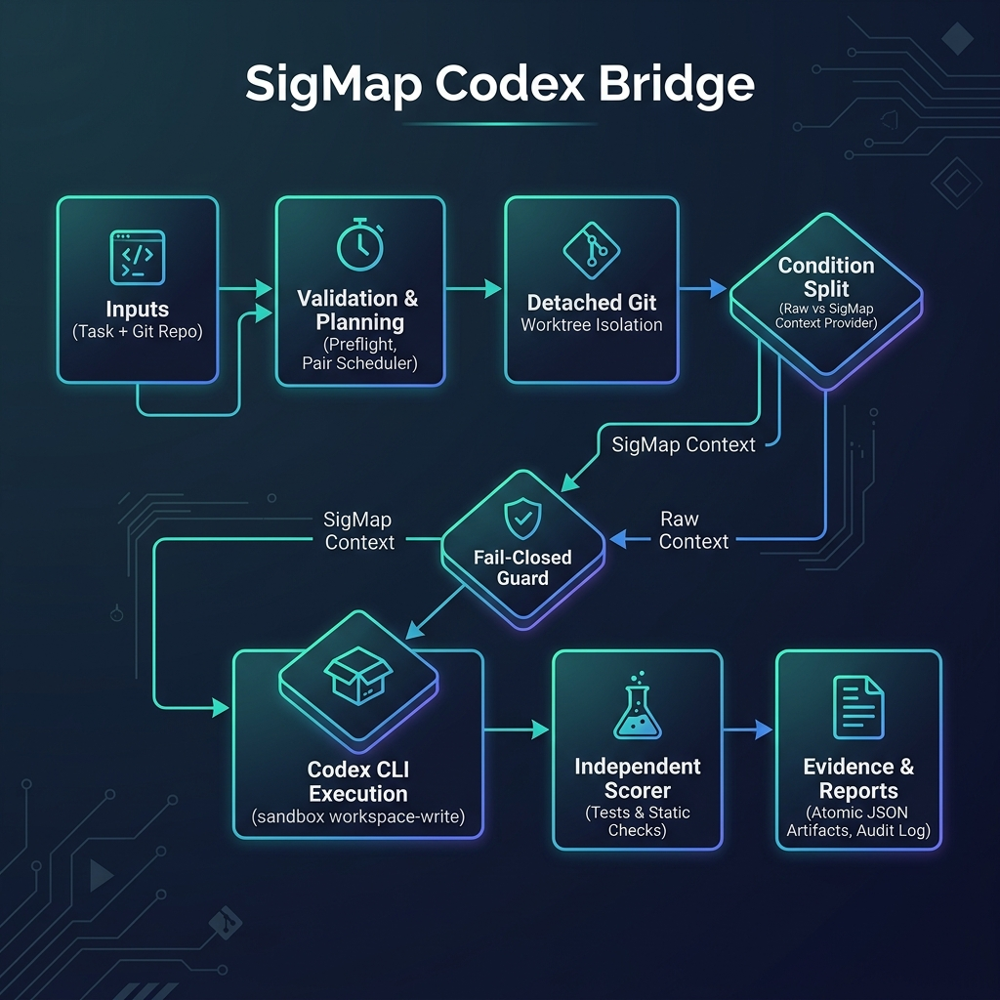
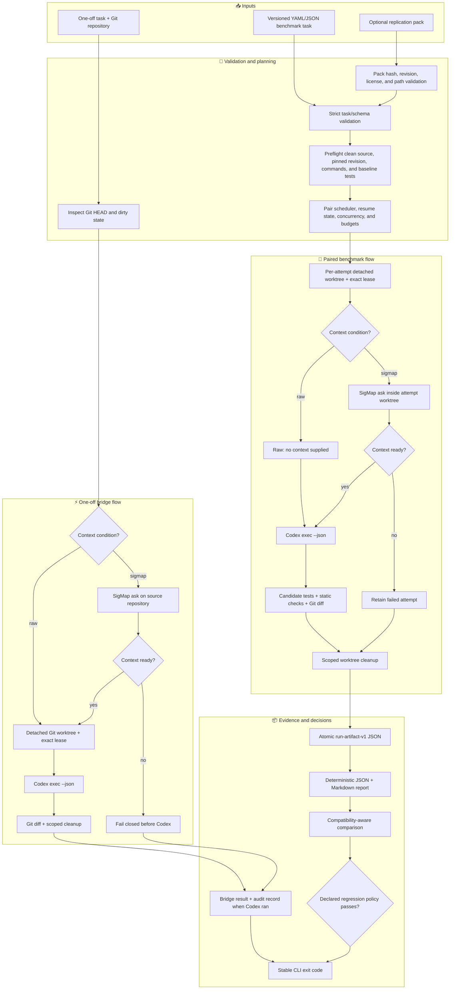
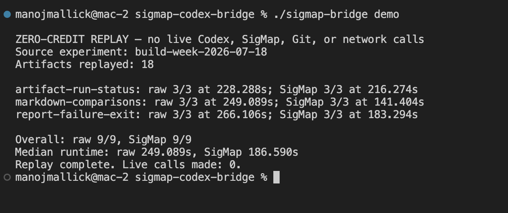
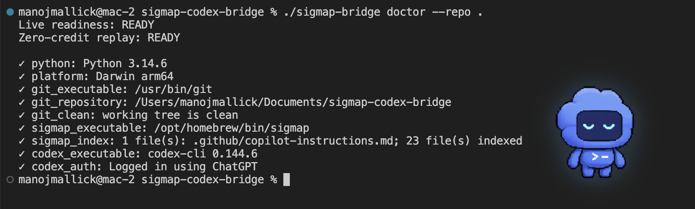
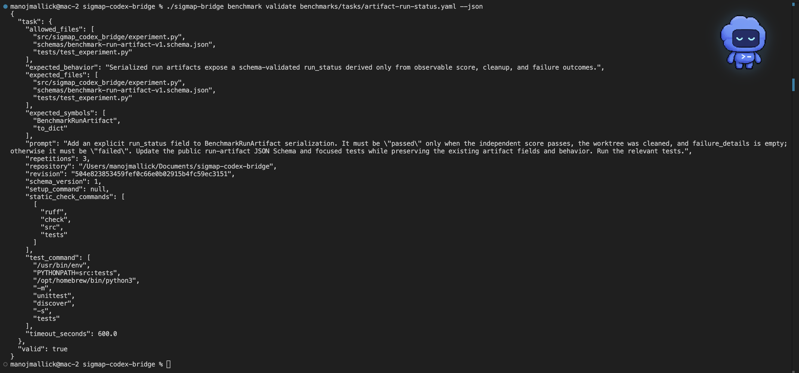
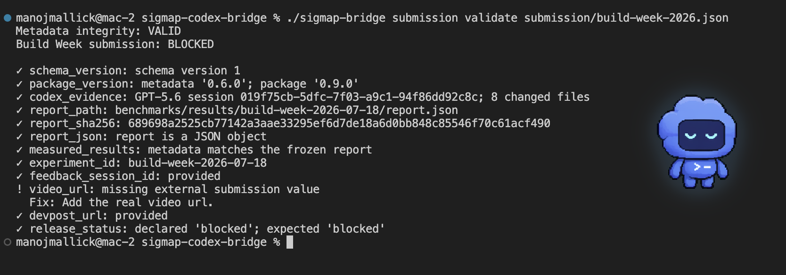

# SigMap Codex Bridge

**Measure whether ranked repository context changes Codex outcomes—with isolated raw-vs-SigMap runs and retained, auditable evidence.**

[](LICENSE)
[](pyproject.toml)
[](.github/workflows/ci.yml)
[](pyproject.toml)
[](src/sigmap_codex_bridge/codex.py)
[](submission/build-week-2026.json)

Repository-context tools are easy to demo and hard to evaluate: model output is
stochastic, execution environments drift, and favorable runs are easy to
over-select. SigMap Codex Bridge runs Codex with and without SigMap-ranked
context from the same pinned revision, then scores observable outcomes and
retains the evidence. Manoj Mallick built it for OpenAI Build Week 2026 with
strict schemas, recoverable Git isolation, deterministic reports, and a
cross-platform Python CI matrix.

## Table of Contents

- [Why SigMap Codex Bridge](#why-sigmap-codex-bridge)
- [Architecture](#architecture)
- [How it works](#how-it-works)
- [Quick Start](#quick-start)
- [Built with Codex and GPT-5.6](#built-with-codex-and-gpt-56)
- [Configuration](#configuration)
- [Stable contracts](#stable-contracts)
- [Project Structure](#project-structure)
- [Privacy and data handling](#privacy-and-data-handling)
- [Honest Status](#honest-status)
- [Roadmap](#roadmap)
- [License](#license)

## Why SigMap Codex Bridge

| Evaluation pain                                                    | Project response                                                                                                                                         |
| ------------------------------------------------------------------ | -------------------------------------------------------------------------------------------------------------------------------------------------------- |
| A successful patch does not prove that retrieved context helped.   | Run explicit `raw` and `sigmap` conditions and compare complete pairs.                                                                                   |
| Different revisions or dirty working trees invalidate comparisons. | Resolve one commit, reject dirty benchmark sources, and execute in detached leased worktrees.                                                            |
| A retrieval failure can be mistaken for a grounded run.            | Fail closed when SigMap was requested but no ready context is available.                                                                                 |
| Model self-assessment is not an independent correctness signal.    | Run declared candidate tests and static checks; score repository changes and process metrics separately from retrieved context.                          |
| Interrupted or expensive experiments lose evidence.                | Atomically checkpoint execution, reconcile retained artifacts, resume without overwriting completed attempts, and stop at pair boundaries.               |
| Aggregate results can hide failures or incompatible environments.  | Retain failed attempts, exclude incomplete pairs from aggregates, and stratify comparisons by task, model, Codex command, platform, and pack provenance. |
| A benchmark is difficult to reproduce elsewhere.                   | Validate, export, preflight, run, seal, and verify hash-locked replication packs.                                                                        |

## Architecture





The diagram shows both shipped execution paths. A one-off `run` retrieves
SigMap context before creating its worktree. A benchmark attempt retrieves
context inside its own worktree after preflight and scheduling.

## How it works

1. **Validate the input.** A one-off run checks the task and Git repository.
   Benchmark tasks reject unknown fields, unsupported schema versions, shell
   command strings, invalid timeouts, and invalid repetitions. Packs add pinned
   repository, license, task-digest, platform, and path checks.
2. **Prove the baseline.** Benchmark preflight requires a clean source, resolves
   the requested commit, creates a disposable detached worktree, checks command
   availability, and requires the unchanged test baseline to pass.
3. **Isolate each attempt.** `WorktreeManager` creates one exact, recoverable
   lease per run. Candidate changes never land in the source checkout.
4. **Choose the condition.** Raw attempts send no context. SigMap attempts run
   `sigmap ask <task> --top 8 --no-squeeze`; missing, empty, timed-out, or failed
   retrieval does not silently fall back to raw.
5. **Run and observe Codex.** `CodexRunner` executes `codex exec --json` with the
   selected sandbox, parses JSONL events, and records status, thread ID, file
   changes, usage, tool events, command events, stdout, stderr, and duration.
6. **Score independently.** Declared tests and static checks run in the candidate
   worktree. Scoring uses their results plus observable files, patch size,
   runtime, tokens, and event counts. Retrieved context is not a scoring input.
7. **Retain and analyze evidence.** Each attempted benchmark run becomes an
   atomic schema-v1 artifact. Reports are byte-stable for identical inputs,
   preserve failures, analyze complete pairs, and mark small samples as
   insufficient evidence instead of manufacturing certainty.
8. **Resume or replicate when needed.** An opt-in state file supports bounded
   pair concurrency, pair/runtime/token limits, crash reconciliation, exact
   lease diagnosis, and safe resume. Replication packs can be exported, sealed,
   transferred, and verified without silently mixing original and replication
   evidence.

## Quick Start

### Prerequisites

| Path                                 | Requirements                                                                       |
| ------------------------------------ | ---------------------------------------------------------------------------------- |
| Offline replay and report inspection | macOS or Linux; CPython 3.10–3.14; Git                                             |
| Live one-off run                     | Offline requirements plus working, authenticated `codex` and indexed `sigmap` CLIs |
| Live benchmark                       | Live requirements plus commands declared by the selected task                      |

### Install and run the zero-credit replay

```bash
git clone https://github.com/manojmallick/sigmap-codex-bridge.git
cd sigmap-codex-bridge

# Option 1: Direct repo execution (no virtualenv or pip install needed):
./sigmap-bridge demo
./sigmap-bridge demo --json

# Option 2: Virtualenv setup:
python3 -m venv .venv
source .venv/bin/activate
pip install .
sigmap-bridge demo
```

`demo` verifies and replays the report packaged in the wheel. It makes no live
Codex, SigMap, Git, or network calls and requires no model credits.



### Check live readiness

```bash
sigmap-bridge doctor --repo .
sigmap-bridge doctor --repo . --require-live --json
```



`doctor` checks the supported OS/Python range, Git repository, source state,
Codex executable and authentication, and SigMap executable and index.

### Run one isolated task

This is an opt-in live command and may consume model credits:

```bash
sigmap-bridge run \
  "Fix the JWT validation bug and run the relevant tests" \
  --repo /absolute/path/to/target-repository \
  --sandbox workspace-write \
  --json
```

Use `--no-sigmap` for the explicit raw condition. The default is the SigMap
condition.

### Validate and regenerate benchmark evidence

These commands use checked-in inputs and make no Codex or SigMap calls:

```bash
sigmap-bridge benchmark validate benchmarks/tasks/artifact-run-status.yaml --json

sigmap-bridge benchmark report \
  benchmarks/results/build-week-2026-07-18/artifacts \
  --json-output /tmp/sigmap-report.json \
  --markdown-output /tmp/sigmap-report.md \
  --json
```



The checked-in task files reproduce the historical experiment environment and
may reference tools or interpreter paths not present on another machine. Use
`benchmark preflight` before a live run, or author a task for the target
environment from [`schemas/benchmark-task-v1.schema.json`](schemas/benchmark-task-v1.schema.json).

A fresh paired execution is opt-in and may consume model credits:

```bash
sigmap-bridge benchmark run /absolute/path/to/task.yaml \
  --experiment-id local-YYYYMMDD \
  --output-dir /tmp/sigmap-benchmark-runs \
  --state-file /tmp/sigmap-benchmark-state.json \
  --max-workers 2 \
  --max-pairs 3 \
  --json
```

For a no-credit integrity path, validate the bundled replication pack:

```bash
sigmap-bridge benchmark pack validate \
  benchmark_packs/pypa-sampleproject-v1/pack.yaml --json
```

See the [independent replication guide](docs/independent-replication.md) before
running or publishing pack evidence.

Generate a deterministic dashboard from retained artifact directories:

```bash
sigmap-bridge benchmark dashboard \
  benchmarks/results/build-week-2026-07-18/artifacts \
  --json-output /tmp/dashboard.json \
  --markdown-output /tmp/dashboard.md --json
```

### Measured Build Week result

| Condition | Passed checks |  Median runtime | Median total input |
| --------- | ------------: | --------------: | -----------------: |
| Raw       |           9/9 | 249.089 seconds |     766,538 tokens |
| SigMap    |           9/9 | 186.590 seconds |     562,358 tokens |

These values come from 18 retained historical attempts in the checked-in
2026-07-18 report. They describe this three-task experiment only. Run
`sigmap-bridge demo` for the checksum-verified zero-credit replay; use a fresh,
predeclared paired benchmark before drawing conclusions about another project.

## Built with Codex and GPT-5.6

| Requirement                      | What happened in this project                                                                                                                                                                                                                                                                                                                                    |
| -------------------------------- | ---------------------------------------------------------------------------------------------------------------------------------------------------------------------------------------------------------------------------------------------------------------------------------------------------------------------------------------------------------------- |
| How Codex was used               | Codex helped implement the bridge, strict schemas, isolated Git worktrees, independent scoring, paired analysis, resumable execution, tests, release documentation, and judge workflow. It also ran targeted tests and packaging checks after changes.                                                                                                           |
| Where Codex accelerated the work | Repository context ranking identified the submission validator and its contract tests without a broad source read. Codex then kept the validator, machine-readable metadata, README, Devpost copy, and demo script synchronized in one bounded change.                                                                                                           |
| Important decisions              | Raw and SigMap conditions share a pinned revision; missing SigMap context fails closed; correctness comes from tests and observable outputs rather than retrieved context; every attempted run is retained; historical replay is labeled zero-credit rather than presented as a fresh benchmark.                                                                 |
| Precise GPT-5.6 contribution     | In Codex session `019f75cb-5dfc-7f03-a9c1-94f86dd92c8c`, GPT-5.6 added structured submission-provenance validation. It checks the model label, matching `/feedback` UUID, concrete contribution text, safe verification-command array, and repository-local changed files. It also produced the judge-facing documentation and video plan for that contribution. |
| Verifiable evidence              | [`submission/build-week-2026.json`](submission/build-week-2026.json) records the session and verification command. [`tests/test_submission.py`](tests/test_submission.py) covers mismatched models and sessions, unsafe command strings, and escaped file paths. The `/feedback` session remains the authoritative record of the interaction.                    |

### Judge path—no live credits and no project rebuild

From a clean checkout, install the CLI once and replay the packaged evidence:

```bash
python3.12 -m venv .venv
source .venv/bin/activate
python -m pip install .
sigmap-bridge demo
sigmap-bridge submission validate submission/build-week-2026.json
```



The demo makes no Codex, SigMap, Git, or network calls. It verifies the packaged
report checksum and replays the retained historical result. A live benchmark is
optional and is never required for judging this submission.

## Configuration

The package reads **no project-specific environment variables**. Child
processes inherit the current environment unless a library caller supplies an
explicit environment mapping. CLI flags and versioned files are the public
configuration surfaces.

| Variable                                                              | Default                             | Purpose                                                                                                                                                |
| --------------------------------------------------------------------- | ----------------------------------- | ------------------------------------------------------------------------------------------------------------------------------------------------------ |
| `PATH`, current process environment                                   | Inherited by child processes        | Locates Git, Codex, SigMap, Python, test tools, and their external authentication settings. No named credential variable is interpreted by the bridge. |
| `--repo`                                                              | `.`                                 | Target Git repository for `run`, `doctor`, `verify`, and `cleanup`.                                                                                    |
| `--sandbox`                                                           | `workspace-write`                   | Codex sandbox for one-off, benchmark, and pack runs. Choices: `read-only`, `workspace-write`, `danger-full-access`.                                    |
| `--worktree-root`                                                     | `<repo>/.bridge-worktrees`          | Root for bridge-owned `runs/` and `leases/`.                                                                                                           |
| `--audit-log`                                                         | `<repo>/.sigmap_bridge_audit.jsonl` | Hash-chained one-off run audit log; the head checkpoint uses the same name plus `.head`.                                                               |
| `SigMapContextProvider.command`                                       | `("sigmap",)`                       | SigMap executable argument array. `doctor` exposes `--sigmap-command`; benchmark library callers can inject another array.                             |
| `SigMapContextProvider.top`                                           | `8`                                 | Number passed to `sigmap ask --top`.                                                                                                                   |
| `SigMapContextProvider.timeout_seconds`                               | `30.0`                              | Retrieval timeout for one-off runs. Benchmark CLI `--context-timeout` defaults to `120.0`.                                                             |
| `CodexRunner.command`                                                 | `("codex",)`                        | Codex executable argument array. Benchmark and pack commands expose `--codex-command`.                                                                 |
| `CodexRunner.timeout_seconds`                                         | `900.0`                             | One-off Codex timeout. Benchmark attempts use the task's `timeout_seconds`.                                                                            |
| Benchmark task `schema_version`                                       | Required; supported value `1`       | Selects the strict benchmark-task contract.                                                                                                            |
| Benchmark task `timeout_seconds`                                      | `900.0`                             | Per setup, Codex, test, and static-check timeout.                                                                                                      |
| Benchmark task `repetitions`                                          | `1`                                 | Number of alternating raw/SigMap pairs.                                                                                                                |
| `benchmark run --output-dir`                                          | `benchmark_runs`                    | Directory for raw attempt artifacts.                                                                                                                   |
| `benchmark run --start-condition`                                     | `raw`                               | First condition for odd repetitions; order reverses on even repetitions.                                                                               |
| `benchmark run --max-workers`                                         | `1`                                 | Concurrent pairs for resumable execution; valid range is 1–32. Conditions within one pair remain sequential.                                           |
| `--max-pairs`, `--max-runtime-seconds`, `--max-total-tokens`          | Unset                               | Optional resumable execution budgets, evaluated at complete-pair boundaries. Runtime/token limits can overshoot through already-running pairs.         |
| `benchmark pack --workspace`                                          | `.benchmark-pack-workspace`         | Clone/worktree workspace for pack preflight and execution.                                                                                             |
| Artifact, report, pack, execution-state, comparison, and gate schemas | Version `1`                         | Published compatibility boundary in [`schemas/`](schemas/).                                                                                            |
| Provenance attestation and evidence dashboard schemas                 | Version `1`                         | Stable signed-envelope and compatibility-stratified dashboard contracts.                                                                               |

## Stable contracts

Version 1.0.0 freezes the documented CLI, exit-code, provider, and v1 schema
contracts. See the [compatibility and migration policy](docs/stability-and-migration.md),
[provenance threat model](docs/provenance-attestations.md), and
[dashboard contract](docs/evidence-dashboard.md).

### Detailed CLI Options & Subcommands Reference

The `sigmap-bridge` command line interface provides subcommands for zero-credit replay, environment diagnostics, one-off task execution, audit verification, worktree lease cleanup, submission validation, and paired benchmark execution.

#### 1. `sigmap-bridge demo`

Replays packaged historical results without making live model, Git, or network calls.

- `--json`: Emit structured JSON payload instead of human-readable text.

#### 2. `sigmap-bridge doctor`

Diagnoses local readiness for live bridge and benchmark runs.

- `--repo PATH` (default: `.`): Target Git repository root.
- `--codex-command CMD` (default: `codex`): Path or command name for Codex CLI.
- `--sigmap-command CMD` (default: `sigmap`): Path or command name for SigMap CLI.
- `--require-live`: Exit with non-zero code if live-run prerequisites (Codex auth, SigMap index) are missing.
- `--json`: Output diagnostic result in JSON format.

#### 3. `sigmap-bridge run <task>`

Executes an isolated one-off task with Codex.

- `task` (positional): Task prompt or instruction passed to Codex.
- `--repo PATH` (default: `.`): Target Git repository to inspect and branch worktree leases from.
- `--no-sigmap`: Explicitly disable SigMap context retrieval (runs the raw control condition).
- `--sandbox {read-only,workspace-write,danger-full-access}` (default: `workspace-write`): Codex execution sandbox policy.
- `--worktree-root PATH` (default: `<repo>/.bridge-worktrees`): Root directory for temporary detached Git worktrees.
- `--audit-log PATH` (default: `<repo>/.sigmap_bridge_audit.jsonl`): Custom path for the SHA-256 audit log.
- `--json`: Output complete execution result as JSON.

#### 4. `sigmap-bridge submission validate [metadata_file]`

Checks Build Week submission metadata, session evidence, and external readiness.

- `metadata_file` (optional, default: `submission/build-week-2026.json`): Path to submission JSON.
- `--require-ready`: Require external URLs (e.g. video URL) to be non-placeholder and verified ready.
- `--json`: Output validation results in JSON format.

#### 5. `sigmap-bridge provenance <sign|verify>`

Creates or verifies versioned HMAC-SHA256 JSON evidence attestations. Keys are read
from files and never embedded in the output. Verification can pin the expected key ID
and payload SHA-256.

#### 6. `sigmap-bridge verify`

Verifies audit log SHA-256 hash chains and atomic head checkpoints.

- `--repo PATH` (default: `.`): Repository root.
- `--audit-log PATH`: Custom audit log file path.
- `--json`: Output audit verification status as JSON.

#### 7. `sigmap-bridge cleanup <run_id>`

Recovers and cleans an interrupted or orphaned bridge worktree lease.

- `run_id` (positional): Exact lease run ID to remove.
- `--repo PATH` (default: `.`): Source Git repository path.
- `--worktree-root PATH`: Managed worktrees root directory.
- `--json`: Output cleanup result as JSON.

#### 8. `sigmap-bridge benchmark <subcommand>`

- `validate <task_file>`: Validate benchmark task YAML/JSON schema integrity.
- `preflight <task_file>`: Test setup, pinned revision, command availability, and baseline test success in an isolated worktree.
- `run <task_files...>`: Run paired raw/SigMap benchmark repetitions.
  - `--experiment-id ID` (**required**): Unique experiment identifier.
  - `--output-dir PATH` (default: `benchmark_runs`): Output directory for attempt artifacts.
  - `--start-condition {raw,sigmap}` (default: `raw`): Initial condition for odd repetitions.
  - `--sandbox {read-only,workspace-write,danger-full-access}` (default: `workspace-write`): Codex sandbox level.
  - `--model MODEL`: Target model label (e.g., `gpt-5.6`).
  - `--codex-command CMD`: Path/command for Codex CLI.
  - `--context-timeout SECONDS` (default: `120.0`): Timeout for context retrieval in seconds.
  - `--worktree-root PATH`: Override worktree storage path.
  - `--state-file PATH`: Path to state file enabling atomic resumable execution.
  - `--resume`: Resume execution from an existing `--state-file`.
  - `--max-workers N` (default: `1`): Number of concurrent worker threads (1–32).
  - `--max-pairs N`: Maximum number of completed pairs allowed before stopping.
  - `--max-runtime-seconds N`: Maximum total runtime budget in seconds.
  - `--max-total-tokens N`: Maximum total input/output token budget.
  - `--json`: Output execution summary as JSON.
- `report <artifact_dir>`: Re-aggregates raw JSON attempt artifacts into `report.json` and `report.md`.
- `dashboard <artifact_dirs...>`: Writes deterministic JSON/Markdown aggregate views without merging incompatible strata.
- `compare <baseline_dir> <candidate_dir>`: Stratified pair comparison between two benchmark runs.
- `gate <artifact_dir> <policy_file>`: Evaluates explicit regression policies.
- `pack <init|validate|export|preflight|run|seal|verify-evidence>`: Independent replication pack commands.
- `execution <diagnose|recover>`: Inspect or recover state file worktree leases.

## Project Structure

```text
sigmap-codex-bridge/
├── src/sigmap_codex_bridge/cli.py         # CLI commands, flags, and exit behavior
├── src/sigmap_codex_bridge/bridge.py      # one-off SigMap → Codex orchestration
├── src/sigmap_codex_bridge/sigmap.py      # ranked-context retrieval statuses
├── src/sigmap_codex_bridge/codex.py       # Codex JSONL execution and parsing
├── src/sigmap_codex_bridge/worktree.py    # contained worktree leases and recovery
├── src/sigmap_codex_bridge/audit.py       # hash chain and head checkpoint
├── src/sigmap_codex_bridge/benchmark.py   # strict benchmark task model
├── src/sigmap_codex_bridge/preflight.py   # source, revision, command, baseline checks
├── src/sigmap_codex_bridge/experiment.py  # paired attempts and artifacts
├── src/sigmap_codex_bridge/execution.py   # resume state, concurrency, and budgets
├── src/sigmap_codex_bridge/scoring.py     # context-independent scoring
├── src/sigmap_codex_bridge/paired.py      # pair deltas and uncertainty summaries
├── src/sigmap_codex_bridge/reporting.py   # deterministic JSON/Markdown reports
├── src/sigmap_codex_bridge/comparison.py  # compatibility-stratified comparison
├── src/sigmap_codex_bridge/gates.py       # explicit regression policies
├── src/sigmap_codex_bridge/pack.py        # replication and evidence verification
├── src/sigmap_codex_bridge/attestation.py # signed provenance envelopes
├── src/sigmap_codex_bridge/dashboard.py   # stratified evidence dashboards
├── src/sigmap_codex_bridge/demo_data/     # packaged historical replay data
├── schemas/               # public JSON Schema contracts, all currently v1
├── benchmarks/
│   ├── dashboard/         # reproducible aggregate JSON/Markdown view
│   ├── tasks/             # checked-in Build Week benchmark definitions
│   ├── gates/             # executable example regression policy
│   └── results/           # frozen report, methodology, and retained artifacts
├── benchmark_packs/       # portable public-repository replication definition
├── docs/                  # methodology, recovery, judge, and submission guides
├── submission/            # machine-readable Build Week submission metadata
└── tests/                 # unit, integration, contract, packaging, and smoke tests
```

## Privacy and data handling

SigMap Codex Bridge is a local CLI, but it launches external CLIs that may use
network services under their own authentication and data policies.

| Data               | Handling                                                                                                                                                                                        |
| ------------------ | ----------------------------------------------------------------------------------------------------------------------------------------------------------------------------------------------- |
| Task text          | Passed to `sigmap ask` and `codex exec` as an argument. Process command arrays can therefore retain it.                                                                                         |
| Retrieved context  | Read from `.context/query-context.md` when SigMap writes a fresh file, otherwise from SigMap stdout; passed to Codex over stdin. The scoring object does not contain context ground truth.      |
| Process output     | Codex/SigMap/test/static-check stdout, stderr, commands, durations, paths, and Codex final messages are retained in benchmark artifacts.                                                        |
| Repository changes | Produced in detached worktrees, recorded as paths/diffs-derived metrics, then removed through an exact lease. Source-checkout changes are not copied into the worktree.                         |
| One-off audit      | Stores a SHA-256 digest of context, not raw context, plus run/revision IDs, usage, exit code, dirty state, and changed-file metadata. It is hash-chained but not signed or externally anchored. |
| Pack evidence      | Sealed with file hashes and provenance. Verification detects ordinary drift; it does not make the evidence confidential.                                                                        |

Treat artifact directories, execution state, audit logs, and `.context/` as
sensitive. Review them before sharing. Do not benchmark private code unless the
Codex and SigMap data policies and your organization permit it.

## Honest Status

| Area                    | Current status                                                                                                                                                                                                                                        |
| ----------------------- | ----------------------------------------------------------------------------------------------------------------------------------------------------------------------------------------------------------------------------------------------------- |
| Package                 | `1.0.0`; classified **Production/Stable** in `pyproject.toml`.                                                                                                                                                                                        |
| Test support            | CI runs on macOS and Linux with CPython 3.10–3.14. Windows and alternative Python implementations are not claimed.                                                                                                                                    |
| Packaged demo           | Historical, checksum-linked replay of the checked-in 2026-07-18 report. It is not a fresh benchmark and receives no live benchmark credit.                                                                                                            |
| Measured evidence       | Raw artifacts and deterministic reports are checked in under [`benchmarks/results/build-week-2026-07-18/`](benchmarks/results/build-week-2026-07-18/). Inspect or regenerate them; do not generalize one small experiment into a model-quality claim. |
| Independent replication | A hash-locked PyPA `sampleproject` pack is included, but it intentionally contains no live result and PyPA does not endorse this project.                                                                                                             |
| Submission              | Repository, structured GPT-5.6 evidence, Devpost URL, and public video are recorded; checked-in metadata passes the readiness validator.                                                                                                               |
| Security boundary       | Worktree leases, hashes, checkpoints, and optional HMAC attestations detect scoped mutation. They are not sandbox replacements, public-key non-repudiation, distributed locks, or defenses against a compromised key or host.                            |

This project measures; it does not promise that SigMap will improve every task.
To produce a fresh result, define the task and revision before execution, retain
every attempt, run `benchmark report`, and interpret complete compatible pairs.

## Roadmap

These are post-1.0 validation and extension items, not shipped claims:

| Item                                                                                                                         | Tracking / gate                                                                                                                          |
| ---------------------------------------------------------------------------------------------------------------------------- | ---------------------------------------------------------------------------------------------------------------------------------------- |
| Retain and verify at least one fresh independent replication result.                                       | Deferred validation; 1.0.0 makes no independent-replication claim.                                                        |
| Add a public-key attestation algorithm with external key discovery.                                        | Future schema; HMAC-SHA256 is the only v1 algorithm.                                                                      |
| Tag the stable release only after backward-compatibility and cross-platform checks pass on the merge commit. | Explicit release gate; no tag is implied by this README.                                                                  |

## License

[MIT](LICENSE) © 2026 Manoj Mallick.
