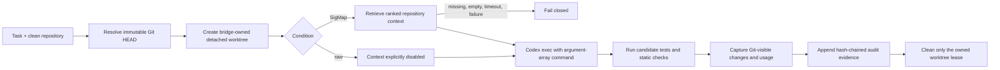
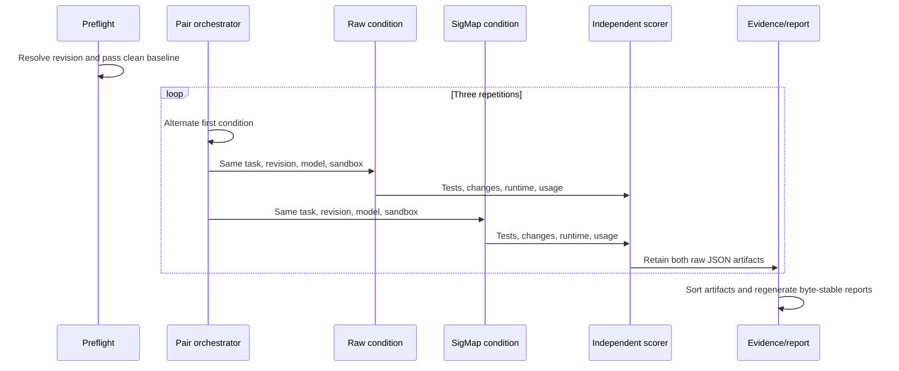
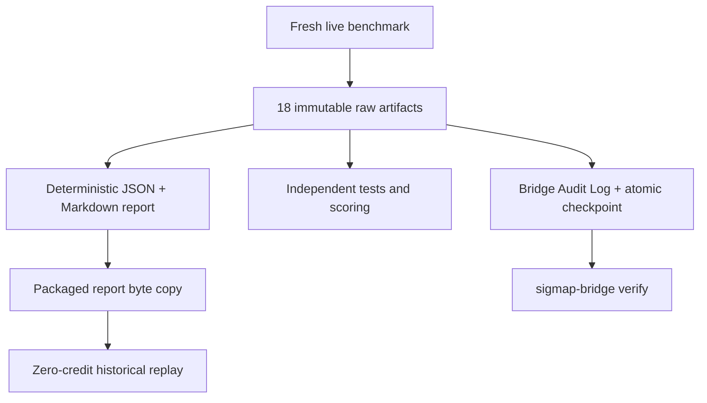

# Architecture and benchmark diagrams

## One bridge run

Retrieved context guides Codex, but it is never correctness ground truth.
Correctness comes from declared tests and observable repository/process output.

## Reproducible paired A/B benchmark

Each repetition is a complete pair. The first condition alternates to reduce
order effects. Every artifact records the resolved revision, exact command,
environment, condition order, process outcomes, changes, independent score,
failure details, and cleanup result.

## Evidence boundaries

The packaged replay verifies report integrity and judge usability. It cannot
create fresh evidence. The Bridge Audit Log detects ordinary insertion,
modification, deletion, and reordering, but is not an externally signed
attestation against an actor who can rewrite every local record.
